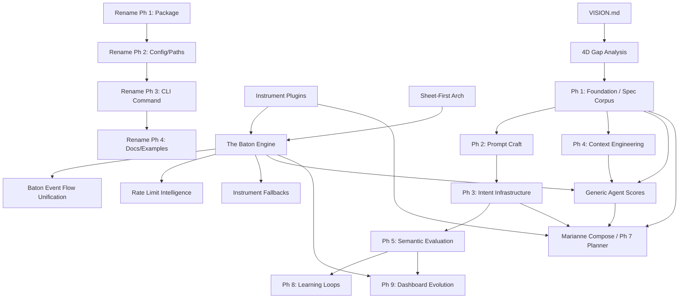

# Marianne Documentation Analysis: Plans, Specs, and Design Documents

This document categorizes and analyzes the planning and design landscape of the Marianne project as of April 9, 2026.

## Executive Summary

Marianne is in a transition phase from a "Discipline 1/2" prompt-execution engine to a sophisticated, autonomous "Discipline 3/4" orchestration infrastructure. 

The **Baton (Execution Engine)** is the most complete and robust part of the new architecture, providing an event-driven, daemon-centric core. The **Four Disciplines** framework provides the strategic roadmap, with most phases (1-9) now having detailed specifications. **Generic Agent Scores** represents the current active frontier, building identity-driven autonomous agents on top of the established Baton infrastructure.

**Strategic Inflection Point:** As of Movement 5 (April 2026), the project has reached an inflection point where the **Baton** is now the default execution model. The "serial critical path" has accelerated, and the project is focused on the **Marianne Rename** and final **v1 Beta** stabilization.

---

## 1. Strategic Foundations & Roadmaps

These documents define the "Why" and the "What" at the highest level.

| Document Group | Files | Completeness | Quality | Complexity |
| :--- | :--- | :--- | :--- | :--- |
| **Project Vision** | `VISION.md` | **Partial** | High | Systemic |
| **North Star Reports** | `workspaces/v1-beta-v3/reports/strategy/M*-north.md` | **Active** | High | Systemic |
| **Atlas Strategic Alignment** | `workspaces/v1-beta-v3/reports/strategy/M*-atlas-strategic-alignment.md` | **Active** | High | Systemic |
| **v1-beta Roadmap** | `docs/plans/2026-03-26-v1-beta-roadmap.md` | **Active** | High | Systemic |
| **Gap Analysis** | `docs/plans/2026-03-01-four-disciplines-gap-analysis-design.md` | **Complete** | High | Systemic |

### Analysis
- **North Star / Atlas Reports**: These are the authoritative "Movement-by-Movement" strategic assessments. They reveal a project that has shifted from "breadth" (many agents doing parallel work) to "depth" (focused serial work on the critical path).
- **Critical Path (M5)**: The current focus is the **Marianne Rename** (Phase 2-5), documentation refresh, and the "Wordware" demo presentation layer.

---

## 2. Plan Inventory (Agent-Readable)

| Plan | Directory | Semantic Blurb |
| :--- | :--- | :--- |
| **Vision** | `/` | The "AI People" philosophy and long-term orchestration goal. |
| **Four Disciplines (1-9)** | `docs/plans/` | Strategic roadmap from Foundation to Learning Loops. |
| **Baton Design** | `docs/plans/` | The event-driven, persistent-state execution engine (Implemented). |
| **Marianne Rename** | `reports/strategy/` | Phased transition from `marianne` to `mzt` (Active). |
| **Instrument Fallbacks** | `reports/strategy/` | Complete feature for rate-limit and availability resilience (Implemented). |
| **Baton Event Flow** | `docs/superpowers/plans/` | Unifying all state changes into the event-driven model (Active). |
| **Rate Limit Intel** | `docs/superpowers/plans/` | Model-aware rate limiting and automatic instrument fallback. |
| **Agent Scores** | `docs/superpowers/plans/` | Identity-driven self-chaining agent cycles (Active). |
| **Instrument Plugins** | `docs/plans/` | Config-driven plugin system for external tools (Implemented). |
| **Sheet-First Architecture**| `docs/plans/` | Movements, voices, and the "music metaphor" in code (Implemented). |
| **Marianne Compose** | `docs/plans/compose-system/` | The `mzt compose` command for autonomous score building. |

---

## 3. Plan Dependency DAG

---

## 4. Implementation Roadmap (Movement 6+)

### Phase 1: The Rename Completion (P0)
**Status:** In Progress
- **Task 1.1:** Rename config paths (`~/.marianne/` -> `~/.mzt/`).
- **Task 1.2:** Rename CLI command (`marianne` -> `mzt`).
- **Task 1.3:** Global documentation and example refresh.
- **Task 1.4:** Verify backward compatibility for legacy path detection.

### Phase 2: Baton Production Integration (The Integration Cliff)
**Status:** Critical Risk
- **Task 2.1:** Remove legacy runner overrides in `conductor.yaml`.
- **Task 2.2:** Execute "Live Hello" on the production conductor via the Baton.
- **Task 2.3:** Resolve "Stale Cost Display" findings (F-108).
- **Task 2.4:** Implement Profiler DB vacuum/rotation (F-488).

### Phase 3: Demo & Presentation
**Status:** Active
- **Task 3.1:** Create the "Wordware Comparison" storytelling layer for the demo.
- **Task 3.2:** Finalize the "Lovable" viral demo score.
- **Task 3.3:** Polished `mzt status` beautification (D-029) refinement.

### Phase 4: Discipline 3 - Intent & Constraints
**Status:** Ready for Implementation
- **Task 4.1:** Implement `IntentConfig` and `intent.yaml` integration.
- **Task 4.2:** Build heuristic `ConstraintChecker`.
- **Task 4.3:** Deploy Escalation Triggers and Fermata pauses.

---

## 5. Outdated / Superseded Plans

1. **`docs/plans/2026-03-01-four-disciplines-phase6-model-selection.md`**: Superseded by **Instrument Plugins**.
2. **`docs/plans/2026-03-26-scheduler-conductor-wiring-design.md`**: Superseded by **Baton Design**.
3. **The "Restaurant Metaphor"**: Officially retired as of Movement 5 in favor of the **Music/Orchestra Metaphor**.
4. **Older "Evolution" Plans (Feb 2026)**: Superseded by the structured **Four Disciplines Phase 8**.
