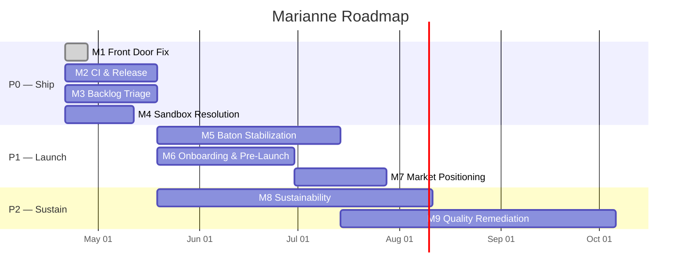

# Roadmap

**Last updated:** 2026-04-29

This is a living document tracking Marianne's path from engineering prototype to shipped product. It reflects the [full strategic roadmap](plans/strategic/2026-04-19-project-roadmap.md) generated by the PM replacement score, updated as milestones progress.

---

## Current Priority

**Ship what's already built.** Marianne has 11,103 tests, mypy strict across 271 files, and near-zero in-code debt — but zero releases, zero CI, and zero external users. The roadmap prioritizes shipping infrastructure, user access, and market positioning before new capability design.

---

## Timeline

---

## Milestones

### M1: Front Door Fix
**Priority:** P0 | **Status:** Done (2026-04-28) | **Depends on:** nothing

A new external user can clone the repo, find accurate README content, and navigate to documentation and examples without hitting broken links or stale metadata.

| Issue | Title | Size | Status |
|-------|-------|------|--------|
| [#270](https://github.com/Mzzkc/marianne-ai-compose/issues/270) | Fix submodule protocol -- change rosetta-corpus to HTTPS | S | Closed |
| [#271](https://github.com/Mzzkc/marianne-ai-compose/issues/271) | Update all README example links to match directory structure | S | Closed |
| [#272](https://github.com/Mzzkc/marianne-ai-compose/issues/272) | Update README metrics | S | Closed |
| [#273](https://github.com/Mzzkc/marianne-ai-compose/issues/273) | Update pyproject.toml description and keywords | S | Closed |

**Follow-on work shipped under M1:** removed dead "native backends" architecture references, reframed instrument system as a plugin/any-CLI system, dropped hardcoded `claude-code` from the hello-marianne quickstart so the conductor's default applies.

---

### M2: CI, Release, and Safety Infrastructure
**Priority:** P0 | **Status:** Open | **Depends on:** nothing (parallel with M1, M3)

Push to main triggers automated quality gates; a tagged release with changelog exists on GitHub.

| Issue | Title | Size |
|-------|-------|------|
| [#274](https://github.com/Mzzkc/marianne-ai-compose/issues/274) | Create GitHub Actions CI workflow | M |
| [#275](https://github.com/Mzzkc/marianne-ai-compose/issues/275) | Add coverage enforcement to CI | S |
| [#276](https://github.com/Mzzkc/marianne-ai-compose/issues/276) | Add automated dependency scanning | S |
| [#277](https://github.com/Mzzkc/marianne-ai-compose/issues/277) | Tag v0.1.0-alpha and create GitHub Release | S |
| [#278](https://github.com/Mzzkc/marianne-ai-compose/issues/278) | Add lock file for reproducible builds | S |
| [#279](https://github.com/Mzzkc/marianne-ai-compose/issues/279) | Create Known Issues launch artifact | S |

---

### M3: Backlog Triage and Tracking Recovery
**Priority:** P0 | **Status:** Open | **Depends on:** nothing (parallel with M1, M2)

Every open issue has a priority label and milestone assignment; stale issues resolved; tracking reflects reality.

| Issue | Title | Size |
|-------|-------|------|
| [#280](https://github.com/Mzzkc/marianne-ai-compose/issues/280) | Tier-label all open issues | M |
| [#281](https://github.com/Mzzkc/marianne-ai-compose/issues/281) | Create GitHub milestones and assign all issues | S |
| [#282](https://github.com/Mzzkc/marianne-ai-compose/issues/282) | Batch-close stale-runner cleanup issues | M |
| [#283](https://github.com/Mzzkc/marianne-ai-compose/issues/283) | Triage 22 roadmap features -- decompose or defer | M |
| [#284](https://github.com/Mzzkc/marianne-ai-compose/issues/284) | Update progress.yaml and decisions.log | M |

---

### M4: Sandbox Resolution
**Priority:** P0 | **Status:** Open | **Depends on:** nothing

Critical path gate. Either the sandbox P0 is resolved architecturally OR a validated sandbox-free quickstart path exists.

| Issue | Title | Size |
|-------|-------|------|
| [#285](https://github.com/Mzzkc/marianne-ai-compose/issues/285) | Contingency: sandbox-free quickstart path | M |

---

### M5: Baton Stabilization
**Priority:** P1 | **Status:** Open | **Depends on:** M2 (CI)

All tier-1 compiler bugs have regression tests; baton correctness bugs resolved; critical integrations wired; schema migration documented.

| Issue | Title | Size |
|-------|-------|------|
| [#286](https://github.com/Mzzkc/marianne-ai-compose/issues/286) | Fix 6 baton correctness bugs | XL |
| [#287](https://github.com/Mzzkc/marianne-ai-compose/issues/287) | Remove 6 stale xfail markers | S |
| [#288](https://github.com/Mzzkc/marianne-ai-compose/issues/288) | Document state reset / schema migration strategy | M |

Plus ~52 auto-review findings assigned to this milestone covering baton, daemon, IPC, state, and execution subsystems.

---

### M6: Onboarding and Pre-Launch
**Priority:** P1 | **Status:** Open | **Depends on:** M1, M2, M4

A new user can pip install, run a score end-to-end with a free local model, and get a validated result within 10 minutes.

| Issue | Title | Size |
|-------|-------|------|
| [#289](https://github.com/Mzzkc/marianne-ai-compose/issues/289) | Create minimal CONTRIBUTING.md | S |
| [#290](https://github.com/Mzzkc/marianne-ai-compose/issues/290) | Cross-link documentation site, mzt.dev, and GitHub README | S |
| [#291](https://github.com/Mzzkc/marianne-ai-compose/issues/291) | Recruit 3-5 beta users and document onboarding friction | M |
| [#292](https://github.com/Mzzkc/marianne-ai-compose/issues/292) | Conduct minimal dashboard security review | M |

---

### M7: Market Positioning and Launch
**Priority:** P1 | **Status:** Open | **Depends on:** M1, M2, M4, M6

SHIPPED: user can pip install, run a score with free model, get validated result, find docs. Launch announcement published.

| Issue | Title | Size |
|-------|-------|------|
| [#293](https://github.com/Mzzkc/marianne-ai-compose/issues/293) | Write 'Why Marianne' positioning page | M |
| [#294](https://github.com/Mzzkc/marianne-ai-compose/issues/294) | Convert mzt.dev root to landing page | M |
| [#295](https://github.com/Mzzkc/marianne-ai-compose/issues/295) | Add licensing FAQ and evaluate AGPL fit | M |
| [#296](https://github.com/Mzzkc/marianne-ai-compose/issues/296) | Prepare and publish launch announcement | M |
| [#297](https://github.com/Mzzkc/marianne-ai-compose/issues/297) | Articulate 'instrument layer above' positioning in README | S |

---

### M8: Sustainability and Capacity
**Priority:** P2 | **Status:** Open | **Depends on:** M3

At least 3 iterations tracked; continuity documentation exists; movement-eligible tasks identified.

| Issue | Title | Size |
|-------|-------|------|
| [#298](https://github.com/Mzzkc/marianne-ai-compose/issues/298) | Adopt burst-compatible iteration tracking | S |
| [#299](https://github.com/Mzzkc/marianne-ai-compose/issues/299) | Document succession/continuity baseline | M |
| [#300](https://github.com/Mzzkc/marianne-ai-compose/issues/300) | Identify movement-eligible tasks per milestone | S |
| [#301](https://github.com/Mzzkc/marianne-ai-compose/issues/301) | Create Dockerfile for reproducible dev environment | M |
| [#302](https://github.com/Mzzkc/marianne-ai-compose/issues/302) | Validate willingness-to-pay with 5 potential users | S |

---

### M9: Quality Remediation
**Priority:** P2 | **Status:** Open | **Depends on:** M2, M5

All 6 tracks of the approved quality remediation plan complete with before/after metrics.

| Issue | Title | Size |
|-------|-------|------|
| [#303](https://github.com/Mzzkc/marianne-ai-compose/issues/303) | Execute quality remediation Track 1 -- full security hardening | L |
| [#304](https://github.com/Mzzkc/marianne-ai-compose/issues/304) | Execute quality remediation Track 3 -- dead code removal | M |
| [#305](https://github.com/Mzzkc/marianne-ai-compose/issues/305) | Address conductor recovery reliability | XL |
| [#306](https://github.com/Mzzkc/marianne-ai-compose/issues/306) | Execute remaining quality remediation tracks | XL |
| [#307](https://github.com/Mzzkc/marianne-ai-compose/issues/307) | Plan API documentation for library consumers | M |

Plus ~17 auto-review findings covering code quality, coupling, naming, and conventions.

---

## Label System

All issues use this taxonomy:

| Dimension | Labels | Purpose |
|-----------|--------|---------|
| **Priority** | `P0` `P1` `P2` `P3` | When must this be done? |
| **Size** | `size-S` `size-M` `size-L` `size-XL` | How much work? |
| **Type** | `bug` `enhancement` `documentation` | What kind of change? |
| **Source** | `auto-review` | Filed by automated quality review |

---

## Descope Recommendations

These capabilities were explicitly deferred. They represent real value but should not be started until M1-M7 milestones exit:

- **New backend integrations** (Ollama, Qwen, etc.) -- market first, then expand platform
- **Dashboard studio** -- the CLI workflow works; dashboard is a luxury until users exist
- **Distributed execution** -- single-machine is the only tested deployment model
- **Email management concert** -- not core to the orchestration product
- **Self-healing improvements** -- the current healing pipeline works; improvements can wait for user feedback

---

*This roadmap is generated and maintained by Marianne's [PM replacement score](https://github.com/Mzzkc/marianne-ai-compose/blob/main/examples/engineering/project-roadmap.yaml). The score itself demonstrates what Marianne does: it orchestrates multiple AI agents through a declarative YAML pipeline to produce this analysis.*
